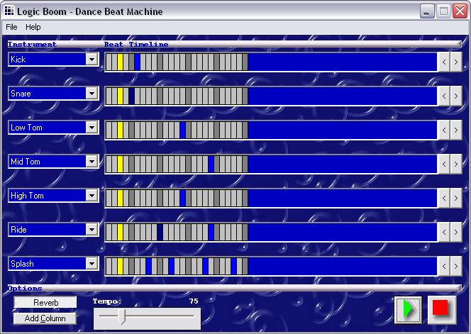



## Logic Boom \- \[DirectX 8 Drum Synthesizer\]

### Description

Logic Boom is a Rave/Techno Beat drum synthesizer made with DirectX® 8.0's Direct Music®. So far, it has many instruments to choose from, variable tempo, and unlimited song length, one downfall is, you cant export as a Wave sound file, I am working on the program save feature right now, but until then, please enjoy the download, and let me know what you think of it!  

P.S. - I don't care so much about the voting, if you want, you can, it might encourage me to work harder and post more, but I would greatly appriciate your feedback so I know how to make things better, thank you!
 
### More Info
 
You need the DirectX SDK to compile

             |
---                |---
**Submitted On**   |2002-09-15 23:46:16
**By**             |[SilverLogic](https://github.com/Planet-Source-Code/PSCIndex/blob/master/ByAuthor/silverlogic.md)
**Level**          |Intermediate
**User Rating**    |4.9 (34 globes from 7 users)
**Compatibility**  |VB 5\.0, VB 6\.0
**Category**       |[DirectX](https://github.com/Planet-Source-Code/PSCIndex/blob/master/ByCategory/directx__1-44.md)
**World**          |[Visual Basic](https://github.com/Planet-Source-Code/PSCIndex/blob/master/ByWorld/visual-basic.md)
**Archive File**   |[Logic\_Boom1316569162002\.zip](https://github.com/Planet-Source-Code/silverlogic-logic-boom-directx-8-drum-synthesizer__1-39034/archive/master.zip)

